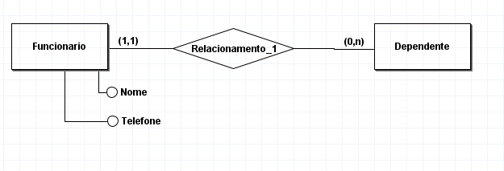

# Banco de dados

## O que é banco de dados

* Bancos de dados armazenam informações que trafegam no mundo digital
* Os dados são armazenados em grandes bancos de dados
* Dados valem dinheiro
* *Banco de dados é uma coleção de dados organizada*

 
 

*Proposta do banco de dados* |
:-----: 
padronizar o acesso a informações |
Segurança de acessos |
Integridade dos dados |
Duplicidade dos dados |
Erros de preenchimento |

 
 

*Links importantes* | *Descrição*
:-----: | :----:
 https://apex.oracle.com/pls/apex/r/apex/workspace/home?session=116163422700046 | Apex Oracle (Learn) *Workspace==institucional
https://academy.oracle.com/en/oa-web-overview.html | Oracle academy (course)
https://portal.azure.com/ | Portal Azure (Cloud)
https://www.devmedia.com.br/guia/modelagem-de-dados/34654 | Modelagem de banco de dados

 
 

## Por onde começar?
### Modelar o banco de dados
##### Esquema - Define a estrutura do banco de dados
##### Instância - banco de dados em um esquema
##### Estado do banco de dados
##### Catálogo (dicionário de dados)– armazena informação sobre o esquema

### Arquitetura de 3 camadas
####  Esquema Interno
#### Esquema Conceitual
#### Esquema Externo --> Visões do usuario

### Exemplo de modelagem conceitual

 
 

## Comando banco de dados

Comando SQL | Descrição1
:-------: | :--------:
SELECT | extrai dados de um banco de dados
UPDATE | atualiza dados em um banco de dados
DELETE | exclui dados de um banco de dados
INSERT INTO | insere novos dados em um banco de dados
CREATE DATABASE | cria um novo banco de dados
ALTER DATABASE | modifica um banco de dados
CREATE TABLE | cria uma nova tabela
ALTER TABLE | modifica uma tabela
DROP TABLE | exclui uma tabela
CREATE INDEX | cria um índice (chave de pesquisa)
DROP INDEX | exclui um índice

 
